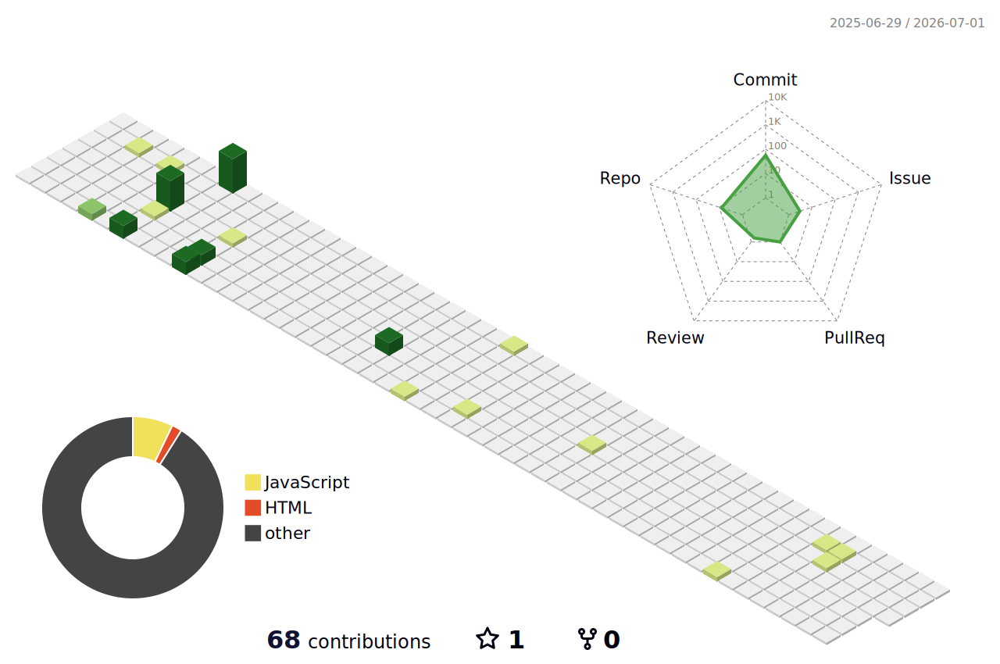

<!-- ═══════════════════════════════════════════════════════════════════
     ASAKUSHEN · GitHub Profile README
     Design: Terminal-dark · Grain · Bento grid · Single palette
     All visual styles are INLINE — no <style> blocks, GitHub-compatible
═══════════════════════════════════════════════════════════════════ -->

<!-- ══ Grain texture (SVG feTurbulence, hidden reference) ══ -->
<svg xmlns="http://www.w3.org/2000/svg" width="256" height="256" style="display:none">
  <filter id="gn">
    <feTurbulence type="fractalNoise" baseFrequency="0.75" numOctaves="3" stitchTiles="stitch"/>
    <feColorMatrix values="0 0 0 0 0.12 0 0 0 0 0.1 0 0 0 0 0.18 0 0 0 0.09 0"/>
  </filter>
  <rect width="100%" height="100%" filter="url(#gn)"/>
</svg>

<!-- ══ Header accent line (SMIL animated) ══ -->
<svg xmlns="http://www.w3.org/2000/svg" height="22" viewBox="0 0 560 22" style="display:block;width:100%;max-width:560px;height:auto;margin:0 auto;">
  <defs>
    <linearGradient id="ahg" x1="0%" y1="0%" x2="100%" y2="0%">
      <stop offset="0%"  stop-color="#6366f1"><animate attributeName="stop-color" values="#6366f1;#818cf8;#a78bfa;#6366f1" dur="7s" repeatCount="indefinite"/></stop>
      <stop offset="50%" stop-color="#818cf8"><animate attributeName="stop-color" values="#818cf8;#a78bfa;#6366f1;#818cf8" dur="6s" repeatCount="indefinite"/></stop>
      <stop offset="100%"stop-color="#10b981"><animate attributeName="stop-color" values="#10b981;#6366f1;#818cf8;#10b981" dur="8s" repeatCount="indefinite"/></stop>
    </linearGradient>
  </defs>
  <line x1="0" y1="0"   x2="560" y2="0"  stroke="url(#ahg)" stroke-width="1.5"/>
  <line x1="0" y1="5.5" x2="560" y2="5.5" stroke="url(#ahg)" stroke-width="0.4" opacity="0.25">
    <animate attributeName="x1"      values="0;120;-60;0"    dur="12s" repeatCount="indefinite"/>
    <animate attributeName="x2"      values="560;680;620;560" dur="12s" repeatCount="indefinite"/>
    <animate attributeName="opacity" values="0.15;0.4;0.15" dur="3.5s" repeatCount="indefinite"/>
  </line>
  <line x1="0" y1="9.5" x2="560" y2="9.5" stroke="#6366f1" stroke-width="0.25" opacity="0.15"/>
</svg>

---

<!-- ════════════════════════════════════════════════════════════
     01 TERMINAL — ASCII-style system intro
═══════════════════════════════════════════════════════════ -->

  

    01 — hello
    

  

  <!-- ASCII Terminal -->
  

<pre style="background:transparent;border:none;padding:0;margin:0;color:#8d94a6;">❯ whoami
Full-Stack Developer · Open Source Enthusiast
❯ cat location.txt
36.2048° N, 18° E — web / network / cli
❯ ls skills/
Python  ████████░░  C/C++   ██████░░░░
JS      ████████░░  HTML/CSS ████████░░
Django   ██████░░░░  DevOps   █████░░░░░
❯ echo $FOCUS
distributed_sys · open_source · web_perf
❯ █</pre>
  

  

    
       Open to collaborate
    
    <a href="https://www.chillg.de" style="display:inline-flex;align-items:center;padding:6px 14px;border-radius:9999px;background:rgba(99,102,241,0.1);border:1px solid rgba(99,102,241,0.18);color:#818cf8;text-decoration:none;font-size:13px;font-weight:450;">🌐 chillg.de</a>
    <a href="mailto:hi@chillg.de" style="display:inline-flex;align-items:center;padding:6px 14px;border-radius:9999px;background:rgba(99,102,241,0.08);border:1px solid rgba(99,102,241,0.12);color:#818cf8;text-decoration:none;font-size:13px;font-weight:450;">✉ hi@chillg.de</a>
  

---

<!-- ════════════════════════════════════════════════════════════
     02 BENTO GRID — Stats + Visual overview
═══════════════════════════════════════════════════════════ -->

  

    02 — overview
    

  

  <!-- Card A: GitHub Stats (WIDE) -->
  

    

      📊 GitHub Stats
      live
    

    

      
      
      
    

    <!-- Contribution snake -->
    

      
    

  

  <!-- Card B: Metrics (WIDE) -->
  

    
  

  <!-- Card C: 3D Contributions -->
  

    
🎨 Contrib

    
  

  <!-- Card D: Visual decoration -->
  

    
✦ Visual

    
    <svg xmlns="http://www.w3.org/2000/svg" viewBox="0 0 260 160" style="width:100%;display:block;overflow:visible;">
      <defs>
        <radialGradient id="vb1" cx="50%" cy="50%" r="50%">
          <stop offset="0%" stop-color="#6366f1" stop-opacity="0.2">
            <animate attributeName="stop-color" values="#6366f1;#818cf8;#a78bfa;#6366f1" dur="8s" repeatCount="indefinite"/>
          </stop>
          <stop offset="100%" stop-color="#4f46e5" stop-opacity="0"/>
        </radialGradient>
        <filter id="vb2">
          <feGaussianBlur stdDeviation="14">
            <animate attributeName="stdDeviation" values="12;20;14;16;12" dur="5s" repeatCount="indefinite"/>
          </feGaussianBlur>
        </filter>
      </defs>
      <g filter="url(#vb2)">
        <path fill="url(#vb1)">
          <animate attributeName="d" dur="10s" repeatCount="indefinite" values="
            M120,15 C168,2 210,38 215,85 C220,132 188,168 148,178 C108,188 50,168 30,122 C10,78 42,22 82,14 C98,10 110,22 120,15 Z;
            M118,18 C170,4 215,42 218,88 C221,135 185,172 142,180 C100,188 48,172 28,125 C10,78 45,24 88,16 C104,12 112,24 118,18 Z;
            M120,15 C168,2 210,38 215,85 C220,132 188,168 148,178 C108,188 50,168 30,122 C10,78 42,22 82,14 C98,10 110,22 120,15 Z"/>
        </path>
      </g>
    </svg>
  

---

<!-- ════════════════════════════════════════════════════════════
     03 TECH STACK
═══════════════════════════════════════════════════════════ -->

  

    03 — stack
    

  

  
Languages

  

    🐍 Python
    ⚡ C / C++
    📜 JavaScript
    🎨 HTML5 / CSS3
    🟩 Django
  

  
Tools & Platform

  

    Git / GitHub
    🐳 Docker
    ☁️ Cloudflare
    ▲ Vercel
    💻 VS Code
    🐧 Linux · Debian
  

---

<!-- ════════════════════════════════════════════════════════════
     04 PROJECTS — Selected work
═══════════════════════════════════════════════════════════ -->

  

    04 — projects
    

  

  <a href="https://www.chillg.de" style="text-decoration:none;color:inherit;">
  

    

      
🌐

      

        
个人博客

        
chillg.de

      

    

    
技术博客 · 编程学习心得 · 系统架构记录

    

      Blog
      Tech
    

  

  </a>

  <a href="https://github.com/Asakushen/Asakushen" style="text-decoration:none;color:inherit;">
  

    

      
🏠

      

        
GitHub Profile

        
this repo · Asakushen/Asakushen

      

    

    
自定义 SVG 动画 · 流体分割线 · 实时统计集成

    

      SVG
      Animation
    

  

  </a>

---

<!-- ════════════════════════════════════════════════════════════
     05 BLOB VISUALS — Generative decoration
═══════════════════════════════════════════════════════════ -->

  

    05 — visual
    

  

  

    

      <svg xmlns="http://www.w3.org/2000/svg" viewBox="0 0 680 200" style="width:100%;height:auto;overflow:visible;">
        <defs>
          <radialGradient id="gbg" cx="50%" cy="50%" r="50%">
            <stop offset="0%" stop-color="#6366f1" stop-opacity="0.18">
              <animate attributeName="stop-color" values="#6366f1;#818cf8;#a78bfa;#10b981;#6366f1" dur="8s" repeatCount="indefinite"/>
            </stop>
            <stop offset="100%" stop-color="#4f46e5" stop-opacity="0"/>
          </radialGradient>
          <filter id="gbf">
            <feGaussianBlur stdDeviation="15">
              <animate attributeName="stdDeviation" values="13;21;15;17;13" dur="5s" repeatCount="indefinite"/>
            </feGaussianBlur>
          </filter>
        </defs>
        <g filter="url(#gbf)">
          <path fill="url(#gbg)">
            <animate attributeName="d" dur="11s" repeatCount="indefinite" values="
              M150,15 C200,0 255,38 262,88 C269,138 230,182 188,200 C146,218 75,195 48,148 C21,102 62,28 112,14 C130,8 140,22 150,15 Z;
              M148,18 C202,2 260,42 264,90 C268,138 228,184 184,202 C140,220 72,198 44,150 C18,102 60,30 115,16 C132,10 142,24 148,18 Z;
              M150,15 C200,0 255,38 262,88 C269,138 230,182 188,200 C146,218 75,195 48,148 C21,102 62,28 112,14 C130,8 140,22 150,15 Z"/>
          </path>
        </g>
        <g filter="url(#gbf)">
          <path fill="url(#gbg)">
            <animate attributeName="d" dur="15s" repeatCount="indefinite" values="
              M480,50 C528,28 578,65 585,112 C592,160 558,198 518,208 C478,218 408,195 382,148 C356,102 396,38 442,25 C460,20 470,36 480,50 Z;
              M478,52 C530,28 582,68 588,116 C594,162 558,202 516,210 C474,218 406,198 380,150 C354,102 394,40 445,27 C462,22 472,38 478,52 Z;
              M480,50 C528,28 578,65 585,112 C592,160 558,198 518,208 C478,218 408,195 382,148 C356,102 396,38 442,25 C460,20 470,36 480,50 Z"/>
          </path>
        </g>
      </svg>
    

  

---

<!-- ════════════════════════════════════════════════════════════
     06 3D CONTRIBUTION MAP
═══════════════════════════════════════════════════════════ -->

  

    06 — contributions
    

  

  

---

<!-- ════════════════════════════════════════════════════════════
     07 CONTACT
═══════════════════════════════════════════════════════════ -->

  

    07 — contact
    

  

  

    <a href="mailto:hi@chillg.de" style="display:inline-flex;align-items:center;padding:6px 14px;border-radius:9999px;background:rgba(99,102,241,0.08);border:1px solid rgba(99,102,241,0.14);color:#818cf8;text-decoration:none;font-size:13px;">✉️ hi@chillg.de</a>
    <a href="https://github.com/Asakushen" style="display:inline-flex;align-items:center;padding:6px 14px;border-radius:9999px;background:rgba(99,102,241,0.08);border:1px solid rgba(99,102,241,0.14);color:#64748b;text-decoration:none;font-size:13px;">💻 @Asakushen</a>
    <a href="https://www.chillg.de" style="display:inline-flex;align-items:center;padding:6px 14px;border-radius:9999px;background:rgba(99,102,241,0.08);border:1px solid rgba(99,102,241,0.14);color:#64748b;text-decoration:none;font-size:13px;">🌐 chillg.de</a>
  

  

  

    感谢来访 · 喜欢的话给个 ⭐ Star 吧 
    Asakushen/Asakushen — Fork 自由使用
  

