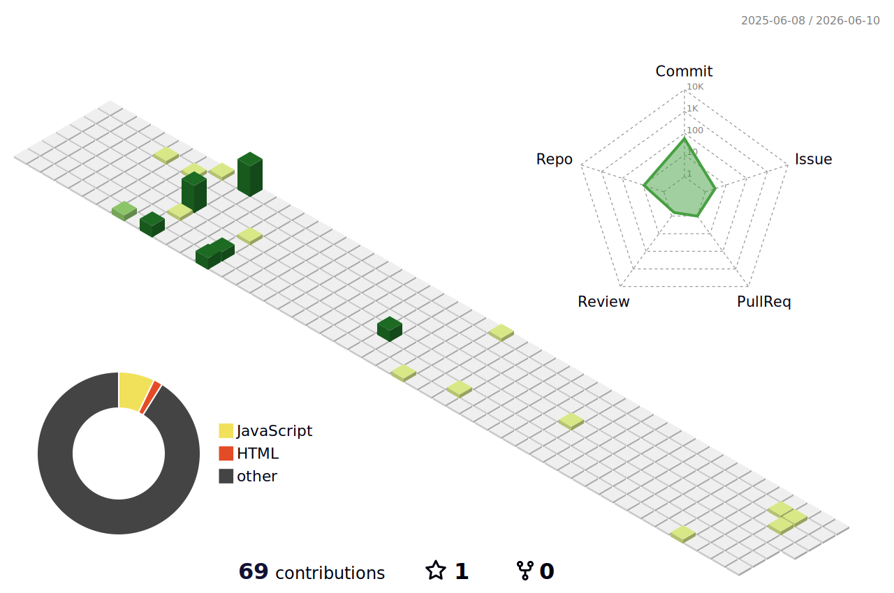

  <!-- Animated particle field background -->
  

    <!-- Morphing blob decoration -->
    

      
    

    

      
    

    <!-- Particle field -->
    

      
    

    

      <!-- Avatar with spring entrance -->
      

        
      

      <!-- Gradient animated name -->
      <h1 style="animation:springIn 0.9s cubic-bezier(0.34,1.56,0.64,1) 0.25s both;margin-top:24px;font-size:42px;font-weight:500;line-height:1.1;letter-spacing:-0.8px;background:linear-gradient(135deg,#f7f8f8 0%,#7170ff 25%,#a78bfa 50%,#10b981 75%,#f7f8f8 100%);background-size:300% 300%;-webkit-background-clip:text;background-clip:text;color:transparent;animation:springIn 0.9s cubic-bezier(0.34,1.56,0.64,1) 0.25s both,gradTextShift 6s ease-in-out infinite;">
        Asakushen
      </h1>

      <!-- Subtitle with typing-like fade -->
      

        Full-Stack Developer · Open Source Enthusiast · Building the future, one commit at a time
      

      <!-- Status badges -->
      

        <a href="https://github.com/Asakushen" style="display:inline-flex;align-items:center;padding:6px 14px;border-radius:9999px;background:rgba(255,255,255,0.04);border:1px solid rgba(255,255,255,0.08);color:#d0d6e0;text-decoration:none;font-size:13px;font-weight:500;transition:all 0.3s cubic-bezier(0.34,1.56,0.64,1);">
          
          Open to collaborate
        </a>
        <a href="https://www.chillg.de" style="display:inline-flex;align-items:center;padding:6px 14px;border-radius:9999px;background:rgba(255,255,255,0.04);border:1px solid rgba(255,255,255,0.08);color:#d0d6e0;text-decoration:none;font-size:13px;font-weight:500;transition:all 0.3s cubic-bezier(0.34,1.56,0.64,1);">
          🌐 www.chillg.de
        </a>
      

      <!-- Fluid wave divider -->
      

        
      

    

  

---

## 📈 技能数据

  

---

## 🛠️ 技术栈

### 核心语言

<a href="#" class="fluid-badge" style="display:inline-flex;align-items:center;padding:8px 16px;border-radius:8px;background:rgba(255,255,255,0.03);border:1px solid rgba(255,255,255,0.08);color:#d0d6e0;text-decoration:none;font-size:14px;font-weight:500;font-family:system-ui,sans-serif;">
  🐍 Python
</a>

<a href="#" class="fluid-badge" style="display:inline-flex;align-items:center;padding:8px 16px;border-radius:8px;background:rgba(255,255,255,0.03);border:1px solid rgba(255,255,255,0.08);color:#d0d6e0;text-decoration:none;font-size:14px;font-weight:500;font-family:system-ui,sans-serif;animation-delay:-1s;">
  ⚡ C/C++
</a>

<a href="#" class="fluid-badge" style="display:inline-flex;align-items:center;padding:8px 16px;border-radius:8px;background:rgba(255,255,255,0.03);border:1px solid rgba(255,255,255,0.08);color:#d0d6e0;text-decoration:none;font-size:14px;font-weight:500;font-family:system-ui,sans-serif;animation-delay:-2s;">
  🟨 JavaScript
</a>

<a href="#" class="fluid-badge" style="display:inline-flex;align-items:center;padding:8px 16px;border-radius:8px;background:rgba(255,255,255,0.03);border:1px solid rgba(255,255,255,0.08);color:#d0d6e0;text-decoration:none;font-size:14px;font-weight:500;font-family:system-ui,sans-serif;animation-delay:-3s;">
  🟥 HTML5/CSS3
</a>

<a href="#" class="fluid-badge" style="display:inline-flex;align-items:center;padding:8px 16px;border-radius:8px;background:rgba(255,255,255,0.03);border:1px solid rgba(255,255,255,0.08);color:#d0d6e0;text-decoration:none;font-size:14px;font-weight:500;font-family:system-ui,sans-serif;animation-delay:-4s;">
  🟩 Django
</a>

### 工具 & 平台

<a href="#" class="fluid-badge" style="display:inline-flex;align-items:center;padding:8px 16px;border-radius:8px;background:rgba(255,255,255,0.03);border:1px solid rgba(255,255,255,0.08);color:#8a8f98;text-decoration:none;font-size:13px;font-family:system-ui,sans-serif;animation-delay:-5s;">
  Git / GitHub
</a>

<a href="#" class="fluid-badge" style="display:inline-flex;align-items:center;padding:8px 16px;border-radius:8px;background:rgba(255,255,255,0.03);border:1px solid rgba(255,255,255,0.08);color:#8a8f98;text-decoration:none;font-size:13px;font-family:system-ui,sans-serif;animation-delay:-6s;">
  Docker
</a>

<a href="#" class="fluid-badge" style="display:inline-flex;align-items:center;padding:8px 16px;border-radius:8px;background:rgba(255,255,255,0.03);border:1px solid rgba(255,255,255,0.08);color:#8a8f98;text-decoration:none;font-size:13px;font-family:system-ui,sans-serif;animation-delay:-7s;">
  Cloudflare
</a>

<a href="#" class="fluid-badge" style="display:inline-flex;align-items:center;padding:8px 16px;border-radius:8px;background:rgba(255,255,255,0.03);border:1px solid rgba(255,255,255,0.08);color:#8a8f98;text-decoration:none;font-size:13px;font-family:system-ui,sans-serif;animation-delay:-8s;">
  Vercel
</a>

<a href="#" class="fluid-badge" style="display:inline-flex;align-items:center;padding:8px 16px;border-radius:8px;background:rgba(255,255,255,0.03);border:1px solid rgba(255,255,255,0.08);color:#8a8f98;text-decoration:none;font-size:13px;font-family:system-ui,sans-serif;animation-delay:-9s;">
  VS Code
</a>

<a href="#" class="fluid-badge" style="display:inline-flex;align-items:center;padding:8px 16px;border-radius:8px;background:rgba(255,255,255,0.03);border:1px solid rgba(255,255,255,0.08);color:#8a8f98;text-decoration:none;font-size:13px;font-family:system-ui,sans-serif;animation-delay:-10s;">
  Linux · Debian
</a>

---

## 📊 数据概览

### 贡献热力图

### 统计数据

### 连续贡献

### Metrics

---

## 🎨 3D 贡献图

  

---

## 🎯 项目展示

<!-- Project Card 1 -->
<a href="https://www.chillg.de" style="text-decoration:none;color:inherit;">
  

    

      
🌐

      <h3 style="margin:0;font-size:17px;font-weight:500;color:#f7f8f8;font-family:system-ui,sans-serif;">个人博客</h3>
    

    

      技术博客 · 编程学习心得 · 系统架构记录
    

    

      Blog
      Tech
    

  

</a>

<!-- Project Card 2 -->
<a href="https://github.com/Asakushen/Asakushen" style="text-decoration:none;color:inherit;">
  

    

      
🏠

      <h3 style="margin:0;font-size:17px;font-weight:500;color:#f7f8f8;font-family:system-ui,sans-serif;">GitHub Profile</h3>
    

    

      动态个人主页 · 流体动画 · 实时统计
    

    

      SVG
      Animation
    

  

</a>

---

## 💬 精选语录

  

    
❝

    

      Code is poetry written for machines to execute and humans to admire.
    

    

  

---

## 📞 联系方式

<a href="mailto:hi@chillg.de" class="fluid-badge" style="display:inline-flex;align-items:center;padding:10px 20px;border-radius:10px;background:rgba(255,255,255,0.04);border:1px solid rgba(255,255,255,0.1);color:#d0d6e0;text-decoration:none;font-size:14px;font-family:system-ui,sans-serif;animation-delay:-1s;">
  ✉️ hi@chillg.de
</a>

<a href="https://github.com/Asakushen" class="fluid-badge" style="display:inline-flex;align-items:center;padding:10px 20px;border-radius:10px;background:rgba(255,255,255,0.04);border:1px solid rgba(255,255,255,0.1);color:#d0d6e0;text-decoration:none;font-size:14px;font-family:system-ui,sans-serif;animation-delay:-2s;">
  💻 GitHub
</a>

<a href="https://www.chillg.de" class="fluid-badge" style="display:inline-flex;align-items:center;padding:10px 20px;border-radius:10px;background:rgba(255,255,255,0.04);border:1px solid rgba(255,255,255,0.1);color:#d0d6e0;text-decoration:none;font-size:14px;font-family:system-ui,sans-serif;animation-delay:-3s;">
  🌐 Blog
</a>

  有问题或合作意向？欢迎邮件联系 
  或者直接在我的任何仓库提交 PR / Issue

---

  

### 💝 感谢访问

  如果喜欢这个主页，可以给仓库点个 ⭐ Star 
  模板在 <a href="https://github.com/Asakushen/Asakushen" style="color:#7170ff;text-decoration:none;">Asakushen/Asakushen</a> · Fork 后自由使用

  

