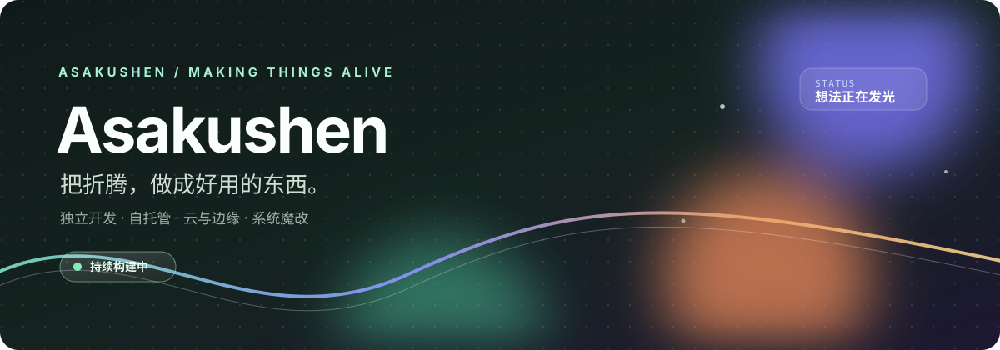

  

  
  
  

 

> 喜欢把散落的需求、复杂的系统和不够顺手的体验，慢慢打磨成简洁、可靠、能真正陪人用下去的小工具。

## 正在做什么 ✦

- **炼化链接与信息**：构建 [浅草玉简 / Chill Jade](https://github.com/Asakushen/chill-jade)，一个以隐私与自托管为先的个人书签花园。
- **把网络状态说人话**：打磨 [NetScope · IP 出口雷达](https://ip.chillg.de)，为 Clash / Meta / Sing-box 的分流排查提供一眼看懂的出口诊断。
- **持续折腾**：AI 工作流、自托管服务、Cloudflare 边缘能力，以及那些能让日常工具更顺一点的小细节。

## 已完成的作品 ✨

<table>
  <tr>
    <td width="50%" valign="top">
      
      <h3>浅草物语</h3>
      
一个有温度的个人博客与数字花园：记录折腾、灵感与生活，也把技术写得不那么冷冰冰。

      
<a href="https://www.chillg.de">访问网站 →</a>

    </td>
    <td width="50%" valign="top">
      
      <h3>NetScope · IP 出口雷达</h3>
      
面向代理分流场景的网络诊断工具：并行看国内、海外、IPv6 与 Cloudflare 视角，快速判断规则是否命中。

      
<a href="https://ip.chillg.de">打开雷达 →</a>

    </td>
  </tr>
  <tr>
    <td width="50%" valign="top">
      
      <h3>浅草玉简 · Chill Jade</h3>
      
一个重视隐私与自托管的个人书签花园：把散落的链接炼化为可回看、可生长的知识园地。

      
<a href="https://github.com/Asakushen/chill-jade">查看源码 →</a>

    </td>
    <td width="50%" valign="top">
      
      <h3>数字方舟图床</h3>
      
轻量、直接的图片上传入口，支持智能压缩；为浅草物语的图片托管与日常分享准备。

      
<a href="https://img.bxxb.de/">上传图片 →</a>

    </td>
  </tr>
</table>

## 我的兴趣雷达 🧭

  
  
  
  
  
  

## 工具箱 🧰

`TypeScript` · `Python` · `React` · `Hono` · `Cloudflare Workers` · `D1` · `Docker` · `Linux` · `GitHub Actions`

## 活动轨迹 🐍

  
   
  慢慢造物，持续迭代。欢迎来玩，也欢迎交换一些有趣的想法。

